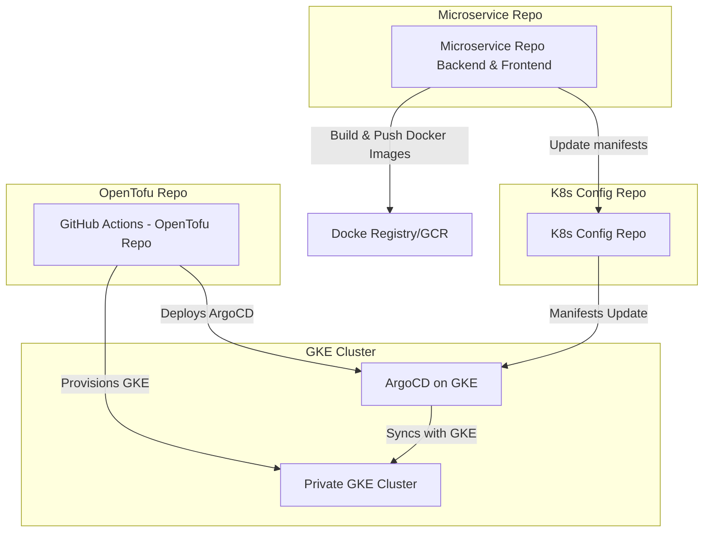

# tf-gke-domo

[](https://github.com/dimpu47/tf-gke-demo/actions/workflows/cicd.yaml)

This repository provides a demo of using OpenTofu to deploy resources on Google Kubernetes Engine (GKE). The demo highlights key steps and configurations required for setting up a GKE cluster using OpenTofu and managing app effectively using ArgoCD.

> CAUTION:  This repository uses [git-crypt](https://www.agwa.name/projects/git-crypt/) to store sensitive information. 
  Please reach out if you need access to decrypt secrets in this repo. 
  Run `git-crypt status` to check which files are encrypted before

#### Unlock repository

```bash
# unlock repo to decrypt sensitive info
git-crypt unlock
# to check which files are encrypted.
git-crypt status
```

## Prerequisites

You should have following tools installed on your system: 

- Tofu: [installation guide](https://opentofu.org/docs/intro/install/) 
- gcloud CLI: [installation guide](https://cloud.google.com/sdk/docs/install#linux)
- gsutil CLI: [installation guide](https://cloud.google.com/storage/docs/gsutil_install)
- kubectl: [installation guide](https://kubernetes.io/docs/tasks/tools/)
- argo CLI: [installation guide](https://argo-cd.readthedocs.io/en/stable/cli_installation)
- git-crypt CLI: [installation guide](https://github.com/AGWA/git-crypt/blob/master/INSTALL.md)
- terraform-docs: [installation guide](https://github.com/terraform-docs/OpenTofu-docs?tab=readme-ov-file#installation) (optional)

## Usage

### OpenTofu service account

```bash
ENV=sandbox
SA_NAME=tofu-$ENV
SA_EMAIL=$SA_NAME@$PROJECT_ID.iam.gserviceaccount.com
PROJECT_ID=$(gcloud config get-value project)
chmod +x ./setup-sa.sh && ./setup-sa.sh
```

Ensure it has following roles:

- Compute Admin
- Kubernetes Engine Admin
- Service Account Token Creator
- Storage Admin 


```bash
# Check roles currently assigned to a given service account
gcloud projects get-iam-policy $PROJECT_ID \
  --flatten="bindings[].members" \
  --format="table(bindings.role)" \
  --filter="bindings.members:serviceAccount:$SA_EMAIL"

```


### Access to remote state bucket
To be able to view content of statefile usng `gsutil`
```
ENV=sandbox
BUCKET=gauro-$ENV-tfstate
gsutil mb -c nearline -l us-central1 -p $PROJECT_ID gs://$BUCKET
gsutil set versioning on gs://$BUCKET
gsutil iam ch user:<your-eamil-id>:objectAdmin gs://$BUCKET
# for debugging purposes only
gsutil cat gs://$BUCKET/tofu/state/$ENV/default.tfstate
```

### enable container service

```bash
# needed to retrive available cluster versions
gcloud services enable \
  container.googleapis.com \
  serviceusage.googleapis.com
```

### KMS Setup for Database (etcd) Encryption

You need to do following steps prior to proviosning GKE cluster using the config in this repo

> FYR: [application layer secrets](https://cloud.google.com/kubernetes-engine/docs/how-to/encrypting-secrets#gcloud_1)

```bash
gcloud kms keyrings create gke-$ENV-ring \                                                   
    --location us-central1 \
    --project $(gcloud config get-value project)
```

```bash
gcloud kms keys create gke-$ENV-enc-key \                                                
    --location us-central1 \
    --keyring gke-$ENV-ring \                   
    --purpose encryption \
    --project $(gcloud config get-value project)
```

```bash
PROJECT_NUMBER=$(gcloud projects describe $PROJECT_ID \
    --format="value(projectNumber)")
gcloud kms keys add-iam-policy-binding gke-$ENV-enc-key \                                
  --location us-central1 \  
  --keyring gke-$ENV-ring \                   
  --member serviceAccount:service-$PROJECT_NUMBER@container-engine-robot.iam.gserviceaccount.com \
  --role roles/cloudkms.cryptoKeyEncrypterDecrypter \
  --project $(gcloud config get-value project)
```

### Init, Plan & Apply
```bash
ENV=sandbox
BUCKET=gauro-$ENV-tfstate
PROJECT_ID=$(gcloud config get-value project)
SA_EMAIL=tofu@$PROJECT_ID.iam.gserviceaccount.com


# fetch gcp serviceaccount key (optional)
gcloud iam service-accounts keys create key.json --iam-account=$SA_EMAIL --key-file-type=json

# generate tfvars
tf-docs tfvars hcl . > $ENV.tfvars
sed -i '' "s|sandbox|$ENV|g" $ENV.tfvars
sed -i '' "s|^project_id         =.*|project_id         = '$PROJECT_ID'|g" $ENV.tfvars


tofu init -backend-config="bucket=$BUCKET" -backend-config="prefix=tofu/state/$ENV -backend-config="credentials=key.json"
# tofu workspace select gauro-$ENV (optional)
tofu plan -var-file $ENV-tfvars -out plan.out
tofu apply -var-file $ENV-tfvars -out plan.out
```


## [High Level Architecure](https://www.mermaidchart.com/raw/b88b3ae6-7d9f-4abb-abbc-651e3f29b91d?theme=light&version=v0.1&format=svg)



## Requirements

No requirements.

## Providers

| Name | Version |
|------|---------|
| <a name="provider_google"></a> [google](#provider\_google) | 6.7.0 |
| <a name="provider_null"></a> [null](#provider\_null) | 3.2.3 |

## Modules

| Name | Source | Version |
|------|--------|---------|
| <a name="module_enabled_google_apis"></a> [enabled\_google\_apis](#module\_enabled\_google\_apis) | terraform-google-modules/project-factory/google//modules/project_services | ~> 17.0.0 |
| <a name="module_gke"></a> [gke](#module\_gke) | terraform-google-modules/kubernetes-engine/google//modules/beta-private-cluster | 33.1.0 |
| <a name="module_vpc"></a> [vpc](#module\_vpc) | terraform-google-modules/network/google | 9.3.0 |

## Resources

| Name | Type |
|------|------|
| [google_compute_router.nat_router](https://registry.terraform.io/providers/hashicorp/google/latest/docs/resources/compute_router) | resource |
| [google_compute_router_nat.main](https://registry.terraform.io/providers/hashicorp/google/latest/docs/resources/compute_router_nat) | resource |
| [google_project_iam_member.gke_nodes](https://registry.terraform.io/providers/hashicorp/google/latest/docs/resources/project_iam_member) | resource |
| [google_service_account.gke_nodes](https://registry.terraform.io/providers/hashicorp/google/latest/docs/resources/service_account) | resource |
| [null_resource.deploy_argo](https://registry.terraform.io/providers/hashicorp/null/latest/docs/resources/resource) | resource |
| [google_client_config.default](https://registry.terraform.io/providers/hashicorp/google/latest/docs/data-sources/client_config) | data source |

## Inputs

| Name | Description | Type | Default | Required |
|------|-------------|------|---------|:--------:|
| <a name="input_argo_ha"></a> [argo\_ha](#input\_argo\_ha) | whether to deploy argo in ha mode or not | `bool` | `false` | no |
| <a name="input_auto_repair"></a> [auto\_repair](#input\_auto\_repair) | n/a | `bool` | `true` | no |
| <a name="input_auto_upgrade"></a> [auto\_upgrade](#input\_auto\_upgrade) | n/a | `bool` | `true` | no |
| <a name="input_autoscaling"></a> [autoscaling](#input\_autoscaling) | n/a | `bool` | `true` | no |
| <a name="input_disk_size_gb"></a> [disk\_size\_gb](#input\_disk\_size\_gb) | n/a | `number` | `100` | no |
| <a name="input_env"></a> [env](#input\_env) | n/a | `string` | `"sandbox"` | no |
| <a name="input_gcp_sa_name"></a> [gcp\_sa\_name](#input\_gcp\_sa\_name) | n/a | `string` | `"gke-nodes"` | no |
| <a name="input_gke_cluster_name"></a> [gke\_cluster\_name](#input\_gke\_cluster\_name) | n/a | `string` | `"demo-gke"` | no |
| <a name="input_gke_enc_key"></a> [gke\_enc\_key](#input\_gke\_enc\_key) | n/a | `string` | `"gke-sandbox-enc-key"` | no |
| <a name="input_gke_key_ring"></a> [gke\_key\_ring](#input\_gke\_key\_ring) | n/a | `string` | `"gke-sandbox-ring"` | no |
| <a name="input_gke_master_cidr"></a> [gke\_master\_cidr](#input\_gke\_master\_cidr) | IP Range for GKE Master Nodes | `string` | `"192.168.15.224/28"` | no |
| <a name="input_gke_nodes_sa_roles"></a> [gke\_nodes\_sa\_roles](#input\_gke\_nodes\_sa\_roles) | n/a | `set(string)` | <pre>[<br>  "roles/monitoring.viewer",<br>  "roles/monitoring.metricWriter",<br>  "roles/logging.logWriter",<br>  "roles/stackdriver.resourceMetadata.writer"<br>]</pre> | no |
| <a name="input_initial_node_count"></a> [initial\_node\_count](#input\_initial\_node\_count) | n/a | `string` | `"1"` | no |
| <a name="input_k8s_version"></a> [k8s\_version](#input\_k8s\_version) | GKE version | `string` | `"1.30.5-gke.1014001"` | no |
| <a name="input_machine_type"></a> [machine\_type](#input\_machine\_type) | VM machine type for GKE nodes | `string` | `"e2-standard-2"` | no |
| <a name="input_machine_type_ai"></a> [machine\_type\_ai](#input\_machine\_type\_ai) | VM machine type for GKE nodes | `string` | `"a2-highgpu-1g"` | no |
| <a name="input_max_count"></a> [max\_count](#input\_max\_count) | n/a | `string` | `"10"` | no |
| <a name="input_min_count"></a> [min\_count](#input\_min\_count) | n/a | `string` | `"1"` | no |
| <a name="input_network_name"></a> [network\_name](#input\_network\_name) | VPC Network Name | `string` | `"demo-demo-nw"` | no |
| <a name="input_project_id"></a> [project\_id](#input\_project\_id) | Id of the project all resources go under | `string` | `"your-project-id"` | no |
| <a name="input_region"></a> [region](#input\_region) | GCP region for the resources | `string` | `"us-central1"` | no |
| <a name="input_secondary_ranges"></a> [secondary\_ranges](#input\_secondary\_ranges) | k8s POD and SVC IP Ranges | `any` | <pre>{<br>  "kube": [<br>    {<br>      "ip_cidr_range": "10.0.0.0/18",<br>      "range_name": "kube-pods"<br>    },<br>    {<br>      "ip_cidr_range": "10.40.0.0/24",<br>      "range_name": "kube-svcs"<br>    }<br>  ]<br>}</pre> | no |
| <a name="input_subnets"></a> [subnets](#input\_subnets) | VPC subnets for GKE cluster | `any` | <pre>[<br>  {<br>    "subnet_ip": "10.10.0.0/24",<br>    "subnet_name": "infra-demo-sandbox",<br>    "subnet_private_access": "true",<br>    "subnet_region": "us-central1"<br>  },<br>  {<br>    "subnet_ip": "10.20.0.0/24",<br>    "subnet_name": "kube",<br>    "subnet_private_access": "true",<br>    "subnet_region": "us-central1"<br>  }<br>]</pre> | no |
| <a name="input_zones"></a> [zones](#input\_zones) | GCP zones for the resources | `list(string)` | <pre>[<br>  "us-central1-a",<br>  "us-central1-b",<br>  "us-central1-c"<br>]</pre> | no |

## Outputs

| Name | Description |
|------|-------------|
| <a name="output_cluster_name"></a> [cluster\_name](#output\_cluster\_name) | Cluster name |
| <a name="output_endpoint"></a> [endpoint](#output\_endpoint) | Cluster endpoint |
| <a name="output_location"></a> [location](#output\_location) | Cluster location (region if regional cluster, zone if zonal cluster) |
| <a name="output_snet_sec"></a> [snet\_sec](#output\_snet\_sec) | n/a |
